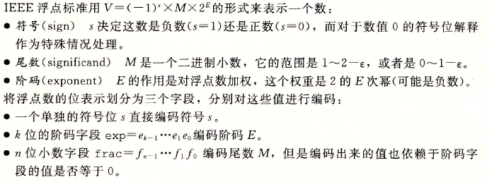

<!-- TOC -->

- [信息的处理和表示](#信息的处理和表示)
    - [1 信息存储](#1-信息存储)
    - [2 整数表示](#2-整数表示)
        - [练习题25](#练习题25)
        - [练习题26](#练习题26)
    - [3 整数运算](#3-整数运算)
        - [练习题32](#练习题32)
        - [总结](#总结)
    - [4 浮点数](#4-浮点数)
        - [规范化的值](#规范化的值)
        - [非规范化值](#非规范化值)
        - [特殊值](#特殊值)
        - [实例学习](#实例学习)
        - [舍入](#舍入)
        - [浮点运算](#浮点运算)
        - [C语言中的浮点数](#c语言中的浮点数)
    - [5 小结](#5-小结)

<!-- /TOC -->

# 信息的处理和表示

**无符号数编码**基于传统的二进制表示法。**补码 (two's-complement) 编码**表示有符号整数的最常见的方式。**浮点数 (floating-point) 编码**是表示实数的科学计数法的以2为基数的版本。


计算机用有限数量的位来对应一个数字编码，当结果太大以至于不能表示时，某些运算就会**溢出**。


整数运算一组正数的运算可能会产生一个负的结果。


浮点运算有完全不同的数学属性，虽然溢出会产生特殊的值 `+无穷` ，但一组正数的乘积总是正的。由于表示的精度有限，浮点运算不可结合。eg： `(3,14+1e20)-1e20` 的值为 `0` ，而 `3.14+(1e20-1e20)` 的值为 `3.14` 。


整数是精确表示，只能编码一个相对较小的数值范围；浮点数是近似表示，表示范围大。

---

## 1 信息存储

计算机使用 **8** 位的块，称为 **字节(byte)** ,作为最小的可寻址的内存单位，而不是访问内存中单独的位。机器级程序将内存视为一个非常大的字节数组，称为 **虚拟内存** 。


**字长(word size)** ，指明指针数据的标称大小，字长决定最重要的系统参数就是 **虚拟地址空间的最大大小** 。


**异或** `(Exclusive-Or[Xor])` ： `A=1 或 B=1 ` 时， `A^B = 1` ； `A=1 且 B=1 ` 时， `A^B = 0` 

---

## 2 整数表示

|编码|特性|
|:---:|:---|
|原码|原码就是二进制定点表示法，即最高位为符号位， “0” 表示正， “1” 表示负，其余位表示数值的大小|
|反码|原码就是二进制定点表示法，即最高位为符号位， “0” 表示正， “1” 表示负，其余位表示数值的大小。|
|补码|正数的补码与其原码相同；负数的补码是在其反码的末位加 1 |


> **补码(Two's complement)** 和 **反码(Ones' complement)** 中 **撇号的位置不同** 。术语补码来源于对于非负数 `x` ，我们用 `2^w-x` (这里只有一个2)来表示 `-x` 的 `w` 位表示。术语反码表示我们用 `[111...1]-x` (这里有很多个1)来计算 `-x` 的反码表示。


对于C语言的实现来说，处理同样字长的有符号数和无符号数之间相互转换的一般规则是：数值可能会改变，但是位模式不变。


要将一个无符号数转换为一个更大的数据类型，需要在开头添加零，这叫做 **零拓展(zero extension)** 。

要将一个补码数字转换为一个更大的数据类型，需要在开头添加最高有效位的值，这叫做 **符号拓展(sign extension)** 。


将一个 `w` 位的数截断为一个 `k` 位的数字时，我们丢弃高 `w-k` 位。

 `x` 是原数， `x'` 是将其截断为k位的结果。 `x'` 无符号数时， `x'=x mod x^k` 。 `x'` 为补码表示时，将无符号 `x'` 转成补码表示即可。

---

### 练习题25

当参数 `length` 等于 `0` 时，这段代码会 `Segmentation fault (core dumped)` :

```c
float sum_elements(float a[],unsigned length){
    int i;
    float result = 0;

    for(i=0;i<=length-1;i++)
        result+=a[i];
    return result;
}
```

答：参数 `ength` 是无符号的，计算 `0-1` 将进行无符号运算，这将得到 `UMAX` ，所有 `int` 都小于等于 `UMAX` ，所以这个条件恒为真，内存访问越界。

修正办法：

* plan1： `length` 声明为 `int` ；
* plan2： `for` 的测试条件改为 `i<length` 

---

### 练习题26

用字符串库函数 `strlen()` 判断一个字符串是否比另一个字符串更长。

```c
size_t strlen(const char* s);

int strlonger(char *s,char*t){
    return (strlen(s)-strlen(t)) > 0;
}

```

错误：当 `s` 比 `t` 短时，因为无符号-无符号还是无符号，实际为负，但是变成了一个很大的无符号数，且大于0；返回1；

修改： `return strlen(s)>strlen(t)` 

---

## 3 整数运算

|运算|计算|溢出检测|
|:---:|:---|:---|
|无符号加法| `0<=x,y<=Umax`  <br>|溢出后 `s<min(x,y)` |
|补码加法| `-2^(w-1)<=x,y<{2^(w-1)-1}` <br>|当 `x,y>0` 且 `x+y<0` 时发生了 **正溢出** <br>当 `x,y<0` 且 `x+y>0` 时发生了 **负溢出** |

---

### 练习题32

如果 `x-y` 不产生溢出，函数就返回 `1` 。

```c
int tsub_ok(int x,int y){
    return tadd_ok(x,-y); 
}

```

当 `y` 取 `Tmin` 时， `-y` 也等于 `Tmin` 。因此函数 `tadd_ok` 会认为只要 `x` 是负数，就会溢出，而 `x` 为非负数，不会溢出。实际上： `x` 为负数时， `tsub_ok(x,TMin)` 为1，而 `x` 为非负时，它为 `0` 。


> 求补码的非：1.按位取反再加一；2.将最右边的1的左边的所有位取反


|运算|计算|
|:---:|:---|
|无符号乘法| `x*y = (x*y) mod 2^w` |
|补码乘法|上式转补码|
|整数乘法、除法|用移位实现|

---

### 总结

计算机执行的 “整数” 运算实际上是一种模运算。表示数字的有限字长限制了可能的值的取值范围，运算结果可能溢出。


补码提供了一种既能表示正数也能表示负数的灵活方法，同时使用了与执行无符号算术相应的位级实现，加减乘数，无论运算数是无符号还是补码，都有完全一样或非常类似的位级行为。

---

## 4 浮点数




根据exp的值，被编码的值可以分成三种不同的情况：


---

### 规范化的值

` exp ` 的位模式不全为 ` 0 ` ，也不全为 ` 1 ` 。阶码的值为 ` E = e-Bias ` 。 ` e ` 是无符号数,(单精度是 ` 1-255 ` ，双精度是 ` 1-2047 ` )， ` Bias ` 是等于 ` 2^(k-1)-1 ` 的值，(单精度 ` 127 ` ，双精度 ` 1023 ` )。所以，指数的取值范围，单精度 ` -126~+127 ` ,双精度 ` -1022~+1023 ` 。

而对于 ` M `，一定是以 ` 1 ` 开头的：也就是 ` M=1.xxx…x2 `。其中` xxx `的部分就是` frac `的编码部分，当` frac=000.00 `的时候值最小`（M=1.0）`，当` frac=111。。。1 `的时候值最大`（M=2.0−ϵ）`，也就是说开头的` 1 `是**『免费附送的』**，并不需要实际的编码位。

例子：`float F = 15213.0`


于是 `frac` 部分的值就是小数点后面的数值，而 `Exp = E + Bias = 13 + 127 = 140 = 10001100` ，于是编码出来的浮点数是这样的：

|0| 10001100|11011011011010000000000|
|:---:|:---:|:---:|
|s  | exp             |frac|

---

### 非规范化值

当阶码为全0时， `E = 1−Bias ` , `M` 以 `0` 开头。

非规格化数有两个用途：

1. 提供了表示数值 `0` 的方法（非规格化数， `M>=1` ，不能表示 `0` ）。
2. 另一个功能是表示非常接近于 `0.0` 的数，可能的数值分布 **均匀（间距一致）** 地接近于 `0.0` 。


### 特殊值

阶码全为 `1` 。当小数域全为 `0` 时，得到的值表示无穷。当小数域非零时，结果为 `"NAN"` ，表示不是实数或无穷，也可表示未初始化的数据。

### 实例学习

`6` 位浮点数，一位符号位 `s` ，阶码 `3` 位，尾数位 `2` 位。可表示的数并不均匀分布——越靠近原点越稠密。


`8` 位浮点数，符号位 `1` 位，阶码 `4` 位，尾数 `3` 位，阶码为 `2^(4-1)-1 = 7` 。


1. 在 `exp=0000` 时，也就是非规范化的情况，间距是一致的，都是 `1/8`
2. 因为位数的限制，从零到一之间的数字只能以 `1/8` 为最小单位来表示，且相邻数字间间距一样
3. 在规范化的部分，可以发现由于 `exp` 部分的不同，所以相邻数字间的间隔也是不同的，比方说最接近 1 的数字是 `15/16` 和 `9/8`，分别相差 `1/16` 和 `1/8`，这也是由于 IEEE 浮点数表示法的公式决定的

可以观察到最大非规格化数 `7/512` 和最小规格化数 `8/512` 之间的平滑转变。这是因为我们把 `E` 定义成 `1-Bias` ，而不是 `-Bias` ，我们可以补偿非规格化的尾数没有隐含的开头的 `1` 。

如果我们将上图的值的位表达式，解释成无符号整数，它们按升序排列，和它们表示的浮点数一样。`IEEE` 设计就是为了浮点数能用整数排序函数进行排序。当处理负数时，它们开头有 `1` ，且按照降序出现。

---

### 舍入

因为表示方式限制了浮点数的范围和精度，所以浮点运算只能近似地表示实数运算。因此对于值`x`，我们一般想用一种系统的方法，能够找到“最接近的”匹配值 `x'` ，这就是 **舍入(rounding)运算** 的任务。 `IEEE` 浮点格式定义了四种不同的舍入方式。默认找到最接近的匹配，其他三种用于计算上界和下界。

//待完善

---

### 浮点运算

---

### C语言中的浮点数

---

## 5 小结

