<!-- TOC -->

- [程序的机器级表示](#程序的机器级表示)
    - [1 历史观点](#1-历史观点)
    - [2 程序编码](#2-程序编码)
    - [2.1 机器级代码](#21-机器级代码)
    - [2.2 代码示例](#22-代码示例)
    - [2.3 关于格式的注解](#23-关于格式的注解)
        - [ATT与Intel汇编代码格式](#att与intel汇编代码格式)
        - [把C程序和汇编代码结合起来](#把c程序和汇编代码结合起来)
    - [3 数据格式](#3-数据格式)
    - [4 访问信息](#4-访问信息)
        - [4.1 操作数指示符](#41-操作数指示符)
        - [4.2 数据传送指令](#42-数据传送指令)
        - [4.3 数据传送示例](#43-数据传送示例)
        - [4.4 压入和弹出栈数据](#44-压入和弹出栈数据)
    - [5 算术和逻辑操作](#5-算术和逻辑操作)
        - [5.1 加载有效地址](#51-加载有效地址)
        - [5.2 一元和二元操作](#52-一元和二元操作)
        - [5.3 移位操作](#53-移位操作)
        - [5.4 讨论](#54-讨论)
        - [5.5 特殊的算术操作](#55-特殊的算术操作)
    - [6 控制](#6-控制)
        - [6.1 条件码](#61-条件码)
            - [比较和测试指令](#比较和测试指令)
        - [6.2 访问条件码](#62-访问条件码)
            - [SET指令](#set指令)
        - [6.3 跳转指令](#63-跳转指令)
        - [6.4 跳转指令的编码](#64-跳转指令的编码)
            - [指令rep和repz的作用](#指令rep和repz的作用)
        - [6.5 用条件控制来实现条件分支](#65-用条件控制来实现条件分支)
        - [6.6 用条件传送来实现条件分支](#66-用条件传送来实现条件分支)
            - [条件传送指令](#条件传送指令)
        - [6.7 循环](#67-循环)
            - [练习题29](#练习题29)
        - [6.8 switch语句](#68-switch语句)
    - [7 过程](#7-过程)
        - [7.1 运行时栈](#71-运行时栈)
        - [7.2 转移控制](#72-转移控制)
        - [7.3 数据传送](#73-数据传送)
        - [7.4 栈上的局部存储](#74-栈上的局部存储)
        - [7.5 寄存器中的局部存储空间](#75-寄存器中的局部存储空间)
        - [7.6 递归过程](#76-递归过程)
    - [8 数组分配和访问](#8-数组分配和访问)
        - [8.1 基本原则](#81-基本原则)
        - [8.2 指针运算](#82-指针运算)
        - [8.3 嵌套的数组](#83-嵌套的数组)
        - [8.4 定长数组](#84-定长数组)
        - [8.5 变长数组](#85-变长数组)
    - [9 异质的数据结构](#9-异质的数据结构)
        - [9.1 结构](#91-结构)
            - [将一个对象表示成 struct](#将一个对象表示成-struct)
        - [9.2 联合](#92-联合)
        - [9.3 数据对齐](#93-数据对齐)
            - [强制对齐](#强制对齐)
    - [10 在机器级程序中将控制与数据结合起来](#10-在机器级程序中将控制与数据结合起来)
        - [10.1 理解指针](#101-理解指针)
        - [10.2 应用：使用GDB调试器](#102-应用使用gdb调试器)
        - [10.3 内存越界引用和缓冲区溢出](#103-内存越界引用和缓冲区溢出)
        - [10.4 对抗缓冲区溢出攻击](#104-对抗缓冲区溢出攻击)
            - [栈随机化](#栈随机化)
            - [栈破坏测试](#栈破坏测试)
            - [限制可执行代码区域](#限制可执行代码区域)
        - [10.5 支持变长栈帧](#105-支持变长栈帧)
    - [11 浮点代码](#11-浮点代码)
        - [11.1 浮点传送和转换操作](#111-浮点传送和转换操作)
        - [11.2 过程中的浮点代码](#112-过程中的浮点代码)
        - [11.3 浮点运算和操作](#113-浮点运算和操作)
        - [11.4 定义和使用浮点常数](#114-定义和使用浮点常数)
        - [11.5 在浮点代码中使用位级操作](#115-在浮点代码中使用位级操作)
        - [11.6 浮点比较操作](#116-浮点比较操作)
        - [11.7 对浮点代码的观察结论](#117-对浮点代码的观察结论)

<!-- /TOC -->

# 程序的机器级表示

计算机执行 **机器代码** ，用字节序列编码低级的操作，包括处理数据，管理内存，读写存储设备上的数据，以及利用网络通信。

**编译器**基于 **编程语言的规则** ， **目标机器的指令集** 和 **操作系统遵循的惯例** ，经过一系列的阶段生成 **机器代码** 。

`GCC C` 语言编译器以 **汇编代码** 的形式产生输出， **汇编代码是机器代码的文本表示** ，给出程序中的每一条指令。

`GCC`调用 **汇编器** 和 **链接器** ，根据 **汇编代码** 生成可执行的 **机器代码** 。

---

## 1 历史观点

`Intel` 处理器系列俗称 `x86`  ，1978 年， `Intel`  发布了第一款  `x86`  指令集的微处理器—— `Intel 8086` 。而后每个后继处理器的设计都是**后向兼容的--较早版本上变异的代码可在较新的处理器上运行**。

> **IA32** :Intel 32位体系结构(Intel Architecture 32-bit)。

> **Intel64** :IA32的64位拓展，也称为x86-64

> **x86** :代指整个系列

---

## 2 程序编码

一个C程序，有两个文件 `p1.c` 和 `p2.c` ，编译代码:

```bash
linux> gcc -Og -o p p1.c p2.c
# 编译选项-Og优化等级可生成符合原始C代码整体结构的机器代码
# 旧版本GCC可以用-O1
```

|**将源代码转化成可执行代码的过程**|
|:---:|
|**C预处理器** 拓展源代码<br>插入用 `#include` 指定的文件<br>拓展用 `#define` 指定的宏<br>⬇|
|**编译器** 产生两个源文件的 **汇编代码** `p1.s` 和 `p2.s` <br>⬇|
|**汇编器** 将汇编代码转化为二进制 **目标代码文件** `p1.o` 和 `p2.o` <br> **目标代码** 是 **机器代码** 的一种形式，它包含所有指令的二进制表示，但还没有填入全局的地址<br>⬇|
|**链接器** 将两个目标代码文件与实现库函数的代码合并，产生最终的 **可执行代码文件** `p`|

---

## 2.1 机器级代码

计算机使用更简单的 **抽象** 模型来隐藏实现的细节

|最重要的两种抽象|
|:---|
|1. **`ISA`(指令集体系结构或指令集架构)** :定义机器级程序的格式和行为，定义了处理器状态，指令的格式，以及每条指令对状态的影响。|
|2. 机器级程序使用的内存地址是虚拟地址，提供的内存模型看上去是一个非常大的字节数组。|

`x86-64` 的机器代码和原始的 `C` 代码差别非常大，一些对 `C` 语言程序员隐藏的处理器状态都是可见的:

|寄存器|功能|
|:---:|:---|
|**程序计数器(`PC`)**|给出将要执行的吓一条指令在内存中的地址|
|**整数寄存器**|包含16个命名的位置，分别存储64位的值。|
|**条件码寄存器**|保存最近执行的算术或逻辑指令的状态信息。|
|**浮点寄存器**|存放浮点数据|

---

## 2.2 代码示例

```c
//mstore.c
long mult2(long,long);
void multstore(long x,long y,long *dest){
    long t = mult2(x,y);
    *dest = t;
}
```

```bash
# 产生汇编文件mstore.s
linux> gcc -0g -S mstore.c
# 产生目标代码文件mstore.o
linux> gcc -Og -c mstore.c
# 反汇编器，根据机器代码文件善生类似于汇编代码的格式
linux> objdump -d mstore.o
```

|机器代码和反汇编特性|
|:---|
|1. `x86-64` 的 **指令长度** 从 `1-15` 字节不等|
|2. **设计指令格式的方式** 是:从某个给定的位置开始，可以将字节惟一地解码成机器指令。eg:只有指令 `pushq %rbx` 以字节值 `53` 开头|
|3. 反汇编器只是基于机器代码文件中的字节序列来确定汇编代码，它不需要源代码或汇编代码。|
|4. 反汇编器使用的指令 **命名规则** 与GCC生成的汇编代码使用的有细微差别。|

**生成实际可执行的代码需要对一组目标代码通过链接器连接，而这一组目标代码文件中必须含有一个`main`函数。**

---

## 2.3 关于格式的注解

```asm
;mstore.s
	.file	"mstore.c"
	.text
	.globl	multstore
	.type	multstore, @function
multstore:
.LFB0:
	.cfi_startproc
	pushq	%rbx
	.cfi_def_cfa_offset 16
	.cfi_offset 3, -16
	movq	%rdx, %rbx
	call	mult2@PLT
	movq	%rax, (%rbx)
	popq	%rbx
	.cfi_def_cfa_offset 8
	ret
	.cfi_endproc
.LFE0:
	.size	multstore, .-multstore
	.ident	"GCC: (Ubuntu 7.3.0-16ubuntu3) 7.3.0"
	.section	.note.GNU-stack,"",@progbits

```

所有以 `.` 开头的行都是知道汇编器和链接器工作的伪指令。

---

### ATT与Intel汇编代码格式

`ATT` 是 `GCC` ， `OBJDUMP` 和其他一些工具的默认格式。

```bash
# 产生Intel格式的汇编代码
linux> gcc -Og -S -masm=intel mstore.c
```

|**Intel和ATT格式的不同**|
|:---|
|1. Intel省略了指示大小的后缀。|
|2. Intel省略了寄存器名字前面的 `%` 符号|
|3. Intel用不同的方式来描述内存中的位置。eg:`QWORD PTR [rbx]`而不是 `(%rbx)` |
|4. 在带有多个操作数的指令下，两组格式列出操作数的顺序相反|

---

### 把C程序和汇编代码结合起来

虽然 `C` 编译器在把程序中的计算转换到机器代码方面十分出色，但是仍然有一些机器特性是 `C` 程序访问不到的。eg: `x86-64` 执行算术或逻辑运算时，如果得到的运算结果的低 `8` 位有偶数个 `1` ，则 `PF` (奇偶标志 `parity falg` )条件码标志设置为 `1` ，否则为 `0` 。在C语言中计算这个信息需要至少 `7` 次移位，掩码和异或运算。在程序在插入几条汇编代码指令就能很容易完成这项任务。

|在C程序中插入汇编代码的方法有|
|:---|
|1. 编写完整的函数，放进独立的汇编代码文件中，让汇编器和链接器将其和 `C` 语言代码结合起来。|
|2. 使用 `GCC` 的内联汇编( `inline assembly` )特性，用 `asm` 伪指令可以在 `C` 程序中包含简短的汇编代码。|

在C程序中包含汇编代码使这些代码与某类特殊的机器相关。

---

## 3 数据格式

由于是由16位体系结构拓展成32位的。Intel用 **word表示16位** 数据类型。 **double words表示32位** 数， **quad words表示64位** 数。

---

## 4 访问信息

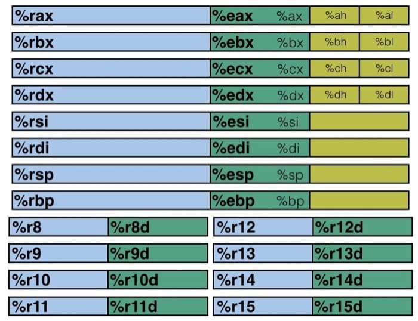

生成1字节和2字节数字和指令会保持剩下的字节不变；生成4字节数字的指令会把高位4个字节置为0.

---

### 4.1 操作数指示符

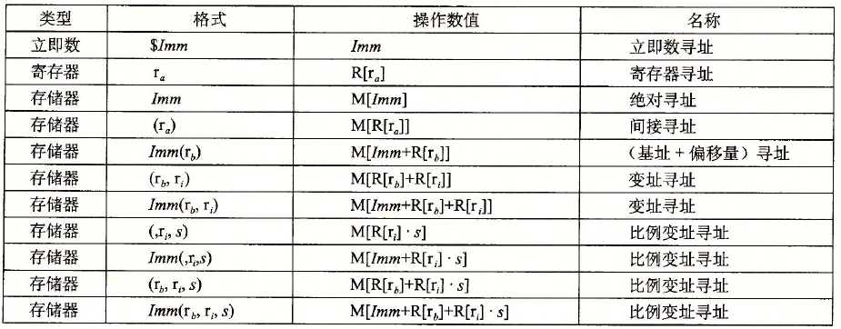
比例因子s必须是1、2、3或者8

---

### 4.2 数据传送指令

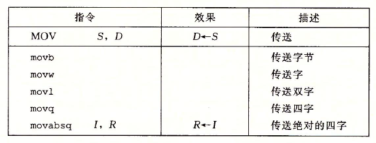

**源操作数** 指定的值是一个立即数，存储在寄存器或内存中。 **目的操作数** 指定一个位置，是一个寄存器或地址。 **传送指令的两个操作数不能都指向从内存地址** 。

传送指令的两个操作数不能都指向内存地址。大多数情况中， `mov` 指令只会更新目的操作数指定的那些寄存器字节或内存为止，但 `movl` 指令以寄存器作为目的时，会把该寄存器的高4位字节设置为0。

常规的 `movq` 指令只能以表示为 **32位补码** 数字的立即数作为源操作数，然后把这个值 **符号拓展** 得到64位的值，放到目的位置。而 `movabsq` 指令能够以任意64位立即数作为源操作数，并且只能以寄存器作为目的。

`movz` 和 `movs` 数据移动指令在将较小的源复制到较大的目的时使用。这些指令把数据从源复制到目的寄存器。

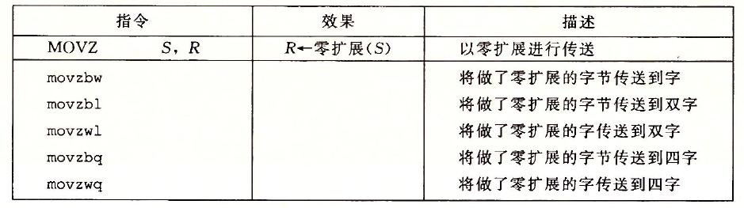

**没有把4字节源零拓展到8字节目的的指令** 。这样的数据传送可以用 `movl` 指令来实现。

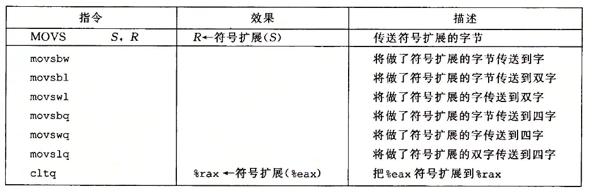

`cltq` 指令(等同于 `movslq %eax,%rax` )没有操作数，它总是以寄存器 `%eax` 作为源， `%rax` 作为符号拓展结果的目的。

```asm
movabsq $0x0011223344556677,%rax	;%rax = 0011223344556677
movb $-1,%al						;%rax = 00112233445566FF
movw $-1,%ax						;%rax = 001122334455FFFF
movl $-1,%eax						;%rax = 00000000FFFFFFFF
mov $-1,%rax						;%rax = FFFFFFFFFFFFFFFF
movabsq $0x0011223344556677,%rax	;%rax = 0011223344556677
movb $0xAA,%dl						;%dl  = AA
movb %dl,%al						;%rax = 00112233445566AA
movsbq %dl,%rax						;%rax = FFFFFFFFFFFFFFAA
movzbq %dl,%rax						;%rax = 00000000000000AA
```

---

### 4.3 数据传送示例

```c
//exchange.c
long exchange(long *xp,long y)	//exchange:
{					//xp in %rdi,y in %rsi
	long x = *xp;	//movq	(%rdi), %rax
	*xp = y;		//movq	%rsi, (%rdi)
	return x;		//ret
}
```

C语言中所谓的 “指针” 其实就是地址。间接引用指针就是将该指针保存在寄存器中，而不是内存中。访问寄存器比访问内存要快得多。

---

### 4.4 压入和弹出栈数据

在x86-64中，程序栈存放在内存中某个区域。 **栈向下增长** ，栈顶元素的地址是所有栈元素地址中最低的。

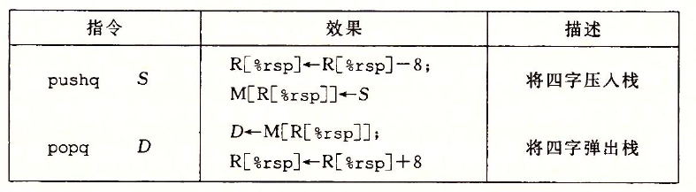

将一个四字值压入栈中，首先需要将栈指针减8，然后将值写入新的栈顶地址。所以 `pushq %rbp` = `sub $8,%rsp` 和 `movq %rbq,(%rsp)`

---

## 5 算术和逻辑操作

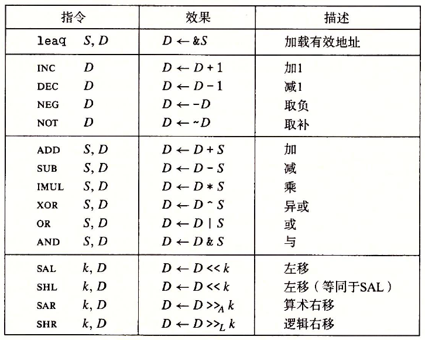

只有 `leaq` 指令没有其他大小的变种。 `leaq` 通常用来执行简单的算术操作。这里的 **操作顺序与ATT格式的汇编代码中的相反** 。

---

### 5.1 加载有效地址


**加载有效地址(load effective address)** 指令 `leaq` 实际上是 `movq` 的变形。该指令将有效地址写入到目的操作数，并不是从指定的位置读入数据。 `leap` 指令能执行加法和有限形式的乘法。

```c
long scale(long x,long y,long z){
	long t = x + 4*y + 12*z;
	return t;
}
```

```asm
scale:
	;x in %rdi,y in %rsi,z in %rdx
	leaq	(%rdi,%rsi,4), %rax	;x = x+4*y
	leaq	(%rdx,%rdx,2), %rcx	;temp = z+2*z
	leaq	0(,%rcx,4), %rdx	;z = temp*4
	addq	%rdx, %rax			;x = x+z
	ret
```

---

### 5.2 一元和二元操作


**一元操作** 数可以是一个寄存器，也可以是一个内存位置。eg： `incq (%rsp)` 会让栈顶的8字节元素加一。

**二元操作** ：第二个操作数既是源又是目的。第一个操作数可以是立即数、寄存器或是内存地址。第二个操作数可以是寄存器或是内存地址。 **当第二个操作数为内存地址时，处理器必须从内存读出值，执行操作，再把结果写回。**

---

### 5.3 移位操作

移位量可以是一个立即数，或者放在单字节寄存器 `%cl` 中。x86-64中，移位操作对 `w` 位长的数据进行操作。 `salb` 看 `cl` 的低  `3`  位数值， `salw` 看 `cl` 的低 `4` 位数值， `sall` 看 `cl` 的低 `5` 位数值， `salq` 看 `cl` 的低 `6` 位数值。

`SAL` 和 `SHL` 左移，在右边补0； `SAR` 算术移位（填上符号位）， `SHR` 逻辑移位（填上0）.

---

### 5.4 讨论

大多数指令，即可用于无符号运算，也可用于补码运算。只有右移操作区分有符号和无符号数。这使得补码运算成为实现有符号整数运算的一种较好的方法。

---

### 5.5 特殊的算术操作

两个 `64` 位有符号或无符号整数相乘得到的乘积需要 `128` 位来表示。 `x86-64` 指令集对 `128` 位( `16` 字节)数的操作提供有限的支持。延续字(`2`字节)、双字( `4` 字节)和四字( `8` 字节)的命名管理，Intel把 `16` 字节的数称为 `8` 字( `oct word` )。

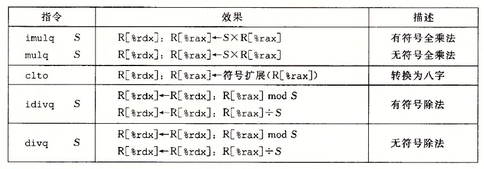

`imulq` 指令有两种不同的形式。其中一种，是 `IMUL` 指令类中的一种。这种形式的 `imulq` 指令是一个 “双操作数” 乘法指令。它从两个 `64` 位操作数产生一个 `64` 位乘积。

```c
//store_uprod.c
#include <inttypes.h>

typedef unsigned __int128 uint128_t;

void store_uprod(uint128_t *dest,uint64_t x,uint64_t y){
	*dest = x*(uint128_t) y;
}
```

`__int128` 是 `GCC` 提供的 `128` 位整数支持。我们用 `typedef` 沿用 `inttypes.h` 的命名规律。

```asm
;store_uprod.s
;dest in %rdi, x in %rsi, y in %rdx
store_uprod:
	movq	%rsi, %rax
	mulq	%rdx
	movq	%rax, (%rdi)
	movq	%rdx, 8(%rdi)
	ret
```

---

## 6 控制

`C` 语言中的语句和机器代码中的指令都是按照它们在程序中出现的次序来顺序执行。用 `jump` 指令可以改变一组机器指令的执行顺序， `jump` 指令指定控制应该被传递到程序的某个其他部分，可能是依赖于某个测试结果。

---

### 6.1 条件码

除了 整数寄存器 ，CPU还维护着一组单个位的 **条件码** (condition code) 寄存器。它们 **描述了最近的算术或逻辑操作的属性** 。可以检测这些寄存器来执行条件分支指令。最常用的条件码有：

|条件码|名称|作用|
|:---:|:---:|:---|
|CF|进位标志|最近的操作使最高位产生了进位。可用来检测无符号操作的溢出|
|ZF|零标志|最近的操作得出的结果为0|
|SF|符号标志|最近的操作得到的结果为负数|
|OF|溢出标志|最近的操作导致一个补码溢出——正溢出或负溢出|

`leaq` 指令不会改变任何条件码，因为它是用来进行地址计算的。除此之外，所有算术和逻辑操作都会设置条件码。对于 **移位操作** ，进位标志将设置为最后一个被移出的位，溢出标志设置为0。 `INC` 和 `DEC` 会设置 溢出 和 零标志 ，但不会改变 进位标志 。

#### 比较和测试指令

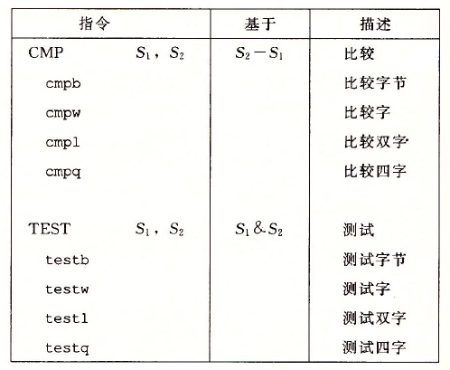

比较和测试指令 只设置 条件码 而不改变任何其他寄存器。 `CMP` 和 `SUB` 指令一样， `TEST` 和 `ADD` 指令一样，除了它们置设置条件码而不改变目的寄存器的值。

---

### 6.2 访问条件码

条件码通常不会直接读取，常用的使用方法有三种：

1. 根据条件码的某种组合，将一个字节设置为0或者1：指令 `set`
2. 可以条件跳转到程序的某个其他部分
3. 可以有条件地传送数据

#### SET指令
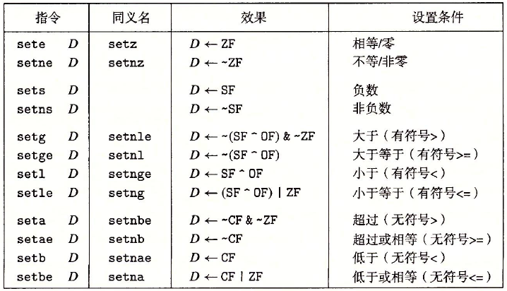

`SET` 指令的目的操作数是 **低位单字节** 寄存器元素之一，或者是一个字节的内存位置。为了得到 `32` 位或 `64` 位的结果，必须对 **高位清零** 。

计算 `C` 语言表达式 `a<b` 的典型指令:

```asm
;int comp(data_t a,data_t b)
;a in %rdi , b in %rsi
comp:
    cmpq %rsi,%rdi  ;虽然参数列出的顺序是 %rsi , %rdi ，实际比较的是 a 和 b
    setl %al
    movzbl %al,%eax ;movzbl会使%rax的高四字节清零
    ret
```

某些底层的机器指令可能有多个名字，我们称之为 **同义名(synonym)** 。eg：setg(设置大于)和setnle(设置不小于等于)指的就是同一条机器指令。编译器和反汇编器会随意决定使用哪个名字。

**无符号比较** 使用的是 进位标志CF 和 零标志ZF 的组合

**有符号比较** 使用是 `SF^OF` 和 `ZF` 的其他组合：当 `OF=1` 时，当且仅当 `SF=0` 时有   `a<b`


---

### 6.3 跳转指令

**跳转指令** 导致执行切换到程序中一个全新的位置。在汇编代码中，这些跳转的目的地通常用一个 标号(label) 指明。

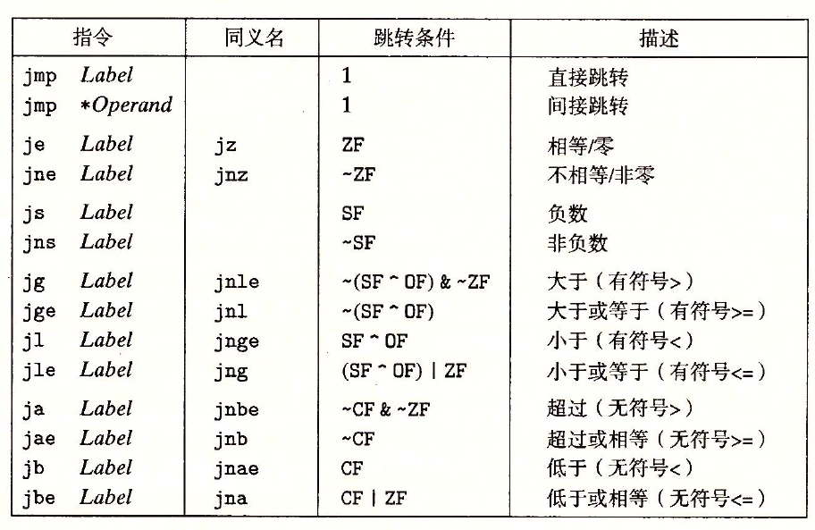

---

### 6.4 跳转指令的编码

在汇编代码中，跳转目标用符号标号书写。汇编器，以及链接器，会产生跳转目标的适当编码。跳转指令有几种不同的编码，但是最常用都是 **PC相对(PC-relative)** 的。也就是，它们会将目标指令的地址与紧跟在跳转指令后的那条指令的地址之间的差作为编码。这些地址的偏移量可以编码为 `1` 、 `2` 或 `4` 个字节。第二种编码方式是给出 “绝对”地址 ，用 `4` 个字节直接指定目标。

#### 指令rep和repz的作用

汇编中常见指令组合 `rep;ret`

`repz` 是 `rep` 的同义名，`retq` 是 `ret` 的同义名。

`rep` 通常用来实现重复的字符串操作。`AND` 给编译器编写者的指导意见书中建议用 `rep` 后面跟 `ret` 的组合来避免使 `ret` 指令称为条件跳转指令的目标。当 `ret` 指令通过跳转指令到达时，处理器不能正确预测 `ret` 指令的目的。这里的 `rep` 指令就是作为一种空操作，因此作为跳转目的插入它，除了能使代码在 `AMD` 上运行的更快，不会改变代码的其他行为。

---

### 6.5 用条件控制来实现条件分支

将条件表达式和语句从 `C` 语言翻译成机器代码，最常用的方式是结合有条件和无条件跳转 (有些条件可以用数据的转移实现，而不是用控制的条件码来实现) 。

---

### 6.6 用条件传送来实现条件分支

实现条件操作的传统方法是通过使用 **控制** 的条件转移。当条件满足时，程序沿着一条执行路径执行，当条件不满足时，就走另一条路径。这种机制简单通用，但在现代处理器上非常低效。

替代上述方法的策略是使用 **数据** 的条件转移。这种方法计算一个条件操作的两种结果，然后根据条件是否满足从中选取一个。只有在受限制的情况这种策略才可行。但是如果可行，就可以用一条简单的 **条件传送指令** 来实现它， **条件传送指令** 更符合现代处理器的性能特性。

| |基于条件控制|基于条件传送|
|:---:|:---|:---|
|原始的C代码|有副作用<br>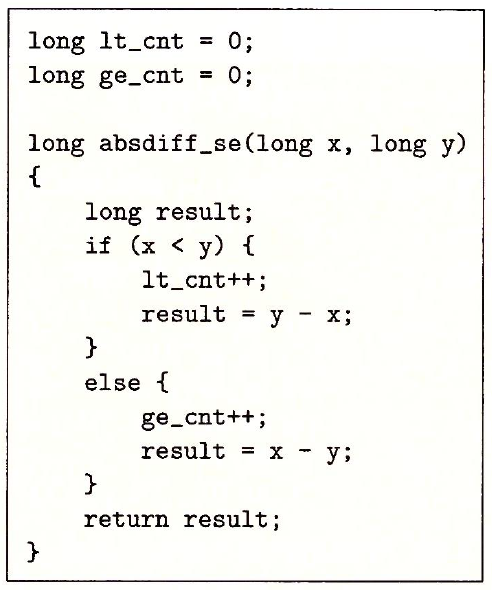|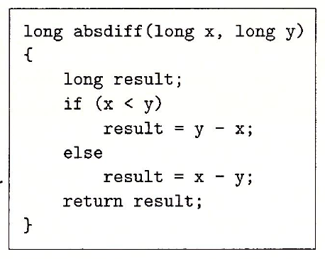|
|汇编代码|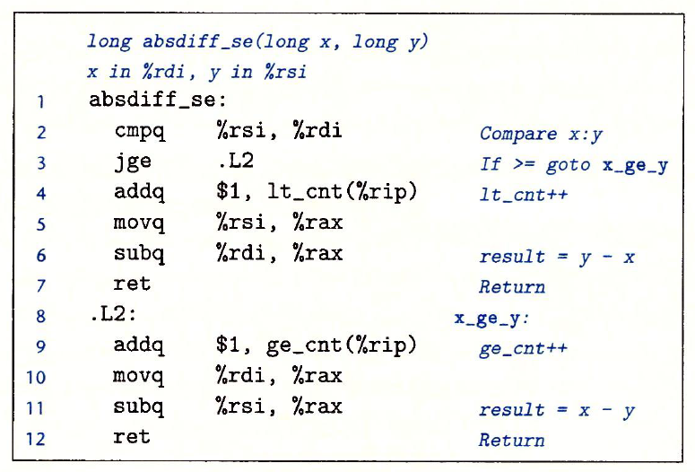|既计算了 `y-x` <br>也计算了 `x-y` 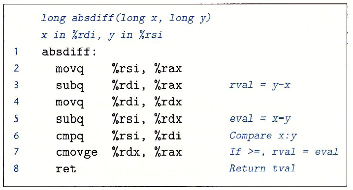|
|C-goto版|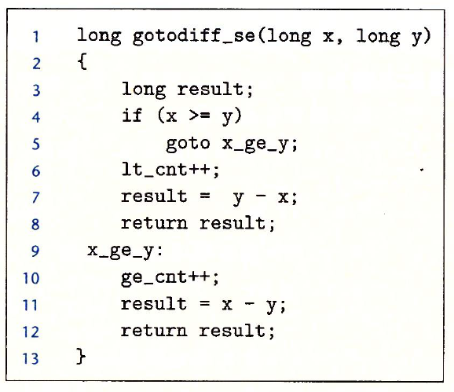|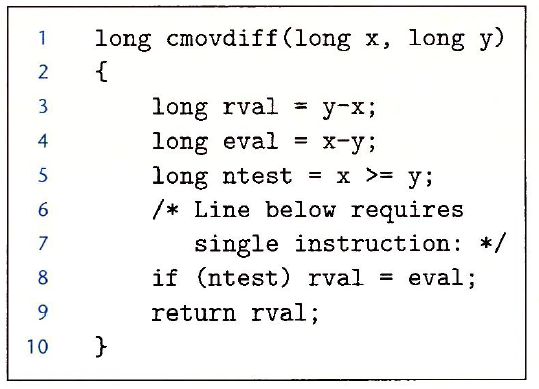|

基于条件数据传送 的代码 比 基于条件控制转移 的代码 性能要好。 **因为** 处理器通过 **流水线** 来获得高性能。这种方法通过重叠连续指令的步骤来获得高性能，例如，在取一条指令的同时，执行它前面一条指令的算术运算。要做到这一点，要求能够事先确定要执行的指令序列，这样才能保持流水线中充满了待执行的指令。当遇到 条件跳转（分支） 时，处理器采用 **分支预测逻辑** 来猜测跳转指令是否会执行。如果错误预测一个跳转，要求指令丢弃为该跳转指令后所有已做的工作，从正确的位置开始的指令取填充流水线。这回导致很严重的惩罚，浪费大约 `15~30` 个时钟周期，导致程序性能严重下降。

> 在 **流水线** 中，一条指令的处理要经过一系列的阶段 (从内存中读指令、确定指令类型、从内存中读数据、执行算术操作、向内存中写数据以及更新程序计数器) ，每个阶段所执行所需操作的一小部分。

#### 条件传送指令

当条件满足时，指令把源值 `S` 复制到目的 `R`。

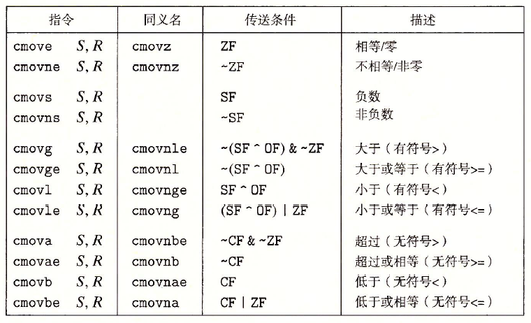

源和目的的值可以是 `16` 位、 `32` 位、 `64` 位长。不支持单字节的条件传送。

同 **条件跳转** 不同，处理器无需预测测试的结果就可以执行 **条件传送** 。

`v = test-expr ? then-expr : else-expr;` 的编译

||条件控制转移|条件传送|
|:---:|:---|:---|
|编译后|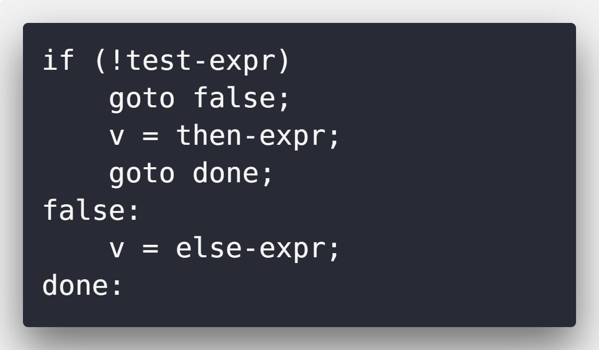|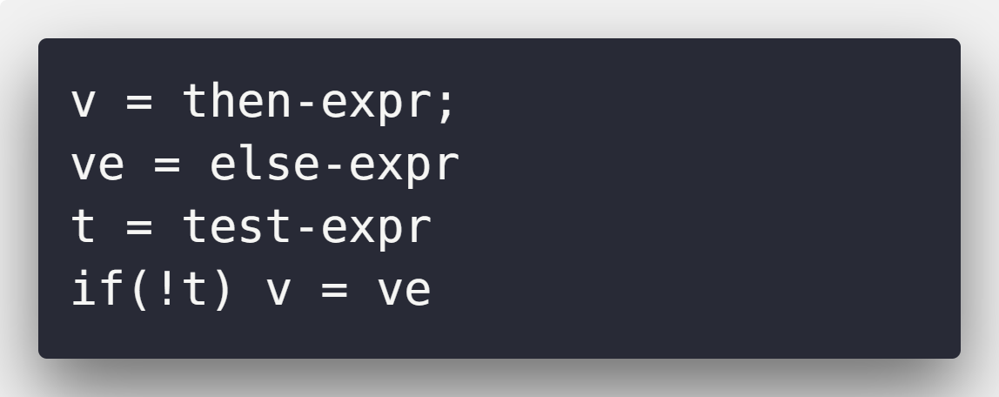|
|详解|包含两个代码序列：<br>* 一个对 `then-expr` 求值<be>另一个对 `else-expr` 求值<br>**条件转移** 和 **无条件跳转** 结合起来使用是为了保证只有一个序列执行|会对 `then-expr` 和 `else-expr` 都求值<br>最终值的选择基于对 `test-expr` 的求值<br>这个序列的最后一条语句是用条件传送实现的|

因为无论测试结果如何，条件传送 会对 `then-expr` 和 `else-expr` 都求值。如果这两个表达式中的任意一个可能产生错误条件或副作用，就会导致非法行为，所以不是所有的条件表达式都可以用条件传送来编译。eg:

```c
//如果用条件传送的话会间接引用一个空指针
long cread(long *xp){
    return (xp?*xp;0);
}
```


因为会把两个分支的运算都提前算出来，如果这两个值都需要大量计算的话，就得不偿失了，所以需要分支中的计算尽量简单。

---

### 6.7 循环

汇编语言用条件测试和跳转指令组合起来实现循环的效果。

---

|循环方式|c语言|汇编语言|
|:---:|:---|:---|
|do-while|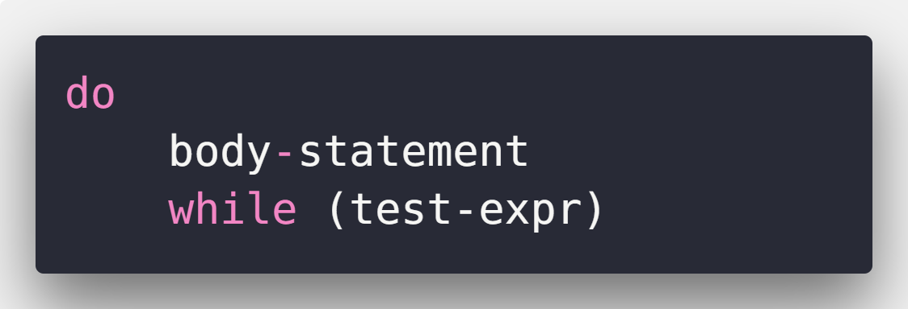|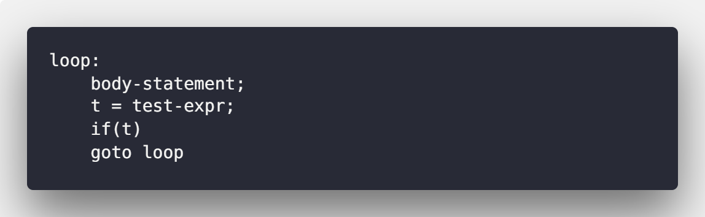|
|while|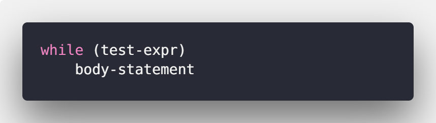|跳转到中间:<br>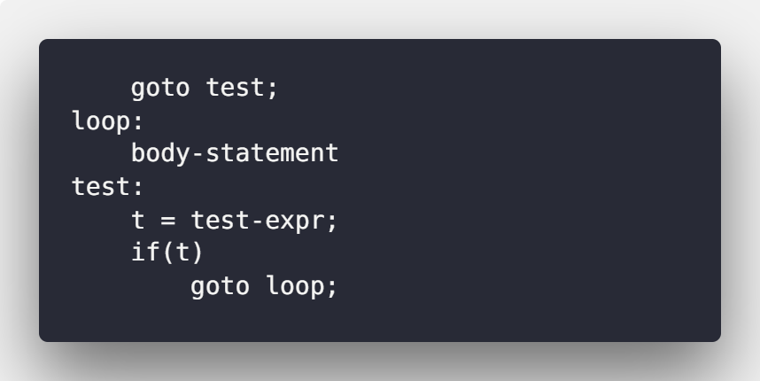<br>条件分支(优化等级较高):<br>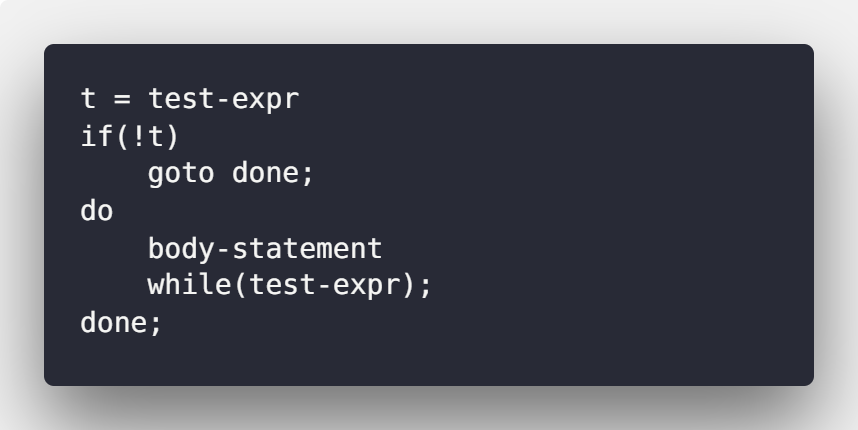|
|for|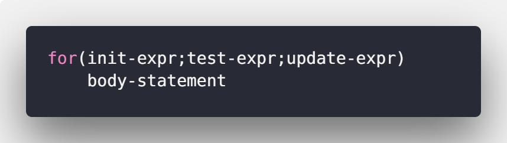|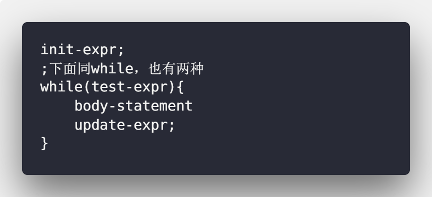|

`C` 语言中执行 `continue` 会导致程序调到当前循环迭代的结果。当处理 `continue` 语句时，将 `for` 循环翻译成 `while` 循环的规则描述需要一些改进。

#### 练习题29

```c
//0-9 的偶数之和
long sum = 0;
long i;
for (i=0;i<10;i++){
    if( i&1 )
        continue;
    sum+=1;
}
```

* 将该程序直接应用将 `for` 翻译到 `while` 循环的规则，会得到什么？哪里出错？

```asm
long sum = 0;
long i = 0;
while( i<10 )｛
    if( i&1 )
        continue;
    sum+=i;
    i++;
｝
```

因为 `continue` 语句会阻止 `i` 被修改，所以这段代码是无限循环。

* 如何用 `goto` 语句替代 `continue` 语句，保证 `while` 循环的行为同 `or` 循环的行为完全一样。

```asm
long sum = 0;
int i = 0;
while(i<10){
    if( i&1 )
        goto update;
    sum+=i;
update:
    i++;
}
```

---

### 6.8 switch语句

`switch` 语句可以根据一个整数索引值进行 **多重分支** 。在处理具有多种可能结果的测试时，这种语句不仅有用且可读性高，而且通过使用 **跳转表(jump-table)** 这种数据结构使得实现更加高效。和使用很长的 `if-else` 相比，其优点是执行 `switch` 语句的时间与开关情况的数量无关。

> 跳转表是一个数组，表项 i 是一个代码段的地址，这个代码段实现当开关索引值等于 i 时程序应采取的动作。

这个例子中包含了大部分比较特殊的情况：

* 共享的条件：`5 `和 `6`
* fall through：`2` 也会执行 `3` 的部分（这个要小心，一般来说不这么搞，如果确定要用，务必写上注释）
* 缺失的条件：`4`

|c|asm|
|:---:|:---:|
|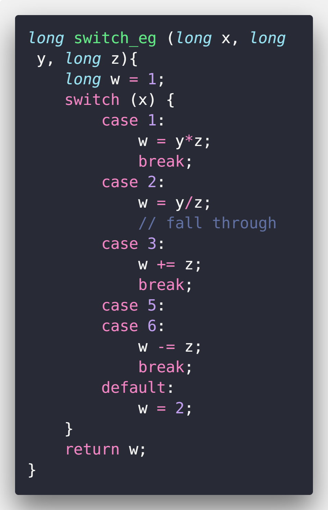|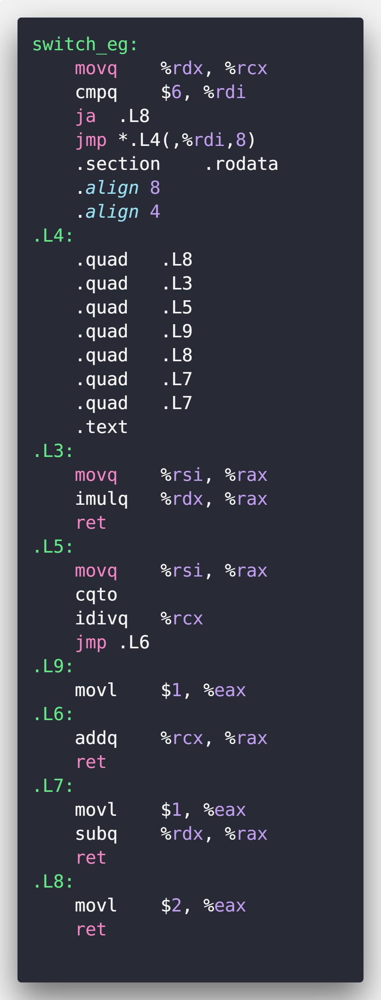|
||先跟 `6` 进行比较<br>间接跳转，然后通过跳转列表来进行跳转<br>程序可以只用一次跳转表引用就分支到 `5` 个不同的位置。<br>当 `switch` 语句有上百种情况时，也可以只用一次跳转表访问去处理|

---

## 7 过程

**过程** 是软件中一种抽象,提供了一种封装代码的方式，用一组指定的参数和一个可选的返回值实现了某种功能。

不同编程语言中， 过程 的形式多样：函数(function)、方法(method)、子例程(subroutine)、处理函数(handler)。

在过程调用中主要涉及三个重要的方面：

1. **传递控制**：包括如何开始执行过程代码，以及如何返回到开始的地方
2. **传递数据**：包括过程需要的参数以及过程的返回值
3. **内存管理**：如何在过程执行的时候分配内存，以及在返回之后释放内存

---

### 7.1 运行时栈

`C` 语言过程调用机制的一个关键特性（大多数语言也是如此）在于使用了 栈数据结构 提供的 后进先出的内存管理原则 。

`x86-64` 的栈向低地址方向增长，而栈指针 `%rsp` 指向栈顶元素。可通过减小栈指针来分配空间，通过增加栈指针来释放空间。

当 `x86-64` 过程需要的存储空间超过寄存器能够存放的大小时，就会在栈上分配空间。这个部分称为过程的 **栈帧(stack-frame)**。

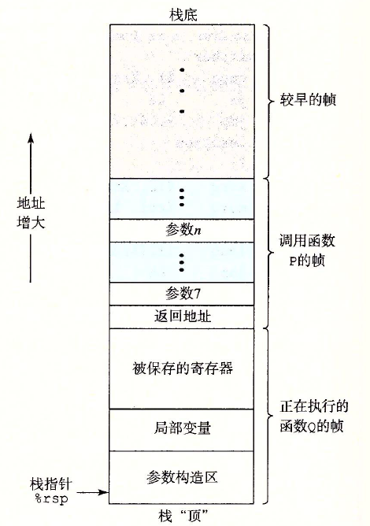

**当前执行的过程的栈总是在栈顶** 。当过程 `P` 调用过程 `Q` 时，会把返回地址压入栈中，指明要从 `P` 程序的哪个位置继续执行。因为这个返回地址存放的是 `P` 相关的状态，所以把它当做 `P` 的栈帧的一部分。 `Q` 的代码会拓展当前栈的边界，分配其栈所需的 空间(保存寄存器的值，分配局部变量，为调用过程设置参数)。**大多数栈帧是定长的**。通过寄存器，过程 `P` 可以传递 `6` 个整数值(指针和整数)，如果 `Q` 需要更多的参数，`P` 可以在调用 `Q` 之前在自己的栈帧里存储好这些参数。

为了提高空间和使用效率，`x86-64` 只分配所需要的栈帧部分。许多过程参数小于等于 `6` 个，这些参数都能通过寄存器传递。所以某些栈帧部分可以省略。实际上， **许多函数根本不需要栈帧** 。当所有局部变量都可以保存在寄存器中。而且该函数不会调用其他函数时就不需要栈帧。

---

### 7.2 转移控制

将控制从函数 `P` 转移到函数 `Q` 只需要把程序计数器 `PC` 设置为 `Q` 的代码的起始位置。当从 `Q` 返回时，处理器必须记录好它需要继续 `P` 的执行的代码位置。在 `x86-64` 机器中，这个信息由指令 `call Q` 调用过程 `Q` 来记录的。该指令把地址 `A` 压入栈中，并将 `PC` 设置为 `Q` 的起始地址。压入的地址 `A` 称为 **返回地址**，是紧跟在 `call` 指令后面的那条指令的地址。对应的指令 `ret` 会从栈中弹出地址 `A` ，并把 `PC` 设置为 `A` 。

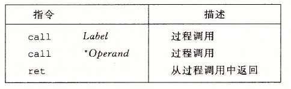

`call` 指令有一个目标，即指明被调用过程起始的指令地址。直接调用的目标是一个标号，而间接调用的目标是 `*` 后面跟一个操作数指示符。

---

### 7.3 数据传送

过程调用还包括 **参数** 和 **返回值** 。`x86-64` 中，大部分过程间的数据传送是通过寄存器实现的。

`x86-64` 中，可以通过寄存器最多传递 `6` 个整形(整数和指针)参数。寄存器的使用是有特殊顺序的，寄存器使用的名字取决于要传递的数据类型的大小，会根据参数在参数列表中的顺序为其分配寄存器。例如，如果第一个参数是 `32` 位的，那么可以用 `%edi` 来访问它。

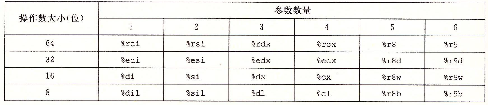

如果一个函数有大于 `6` 个整形参数，超过 `6` 个的部分就要通过栈来传递。如果过程 `P` 调用过程 `Q` ，有 `n` 个整数参数，且 `n>6` 。那么 `P` 的代码分配的栈帧必须要能容纳 `7` 到 `n` 号参数的存储空间(参数构造区)。把参数 `1~6` 复制到对应的寄存器，参数 `7~n` 放到栈上，参数 `7` 放到栈顶。通过栈传递参数时，所有的数据大小都向 `8` 的倍数对齐。

|c|asm|栈帧结构|
|:---|:---|:---|
|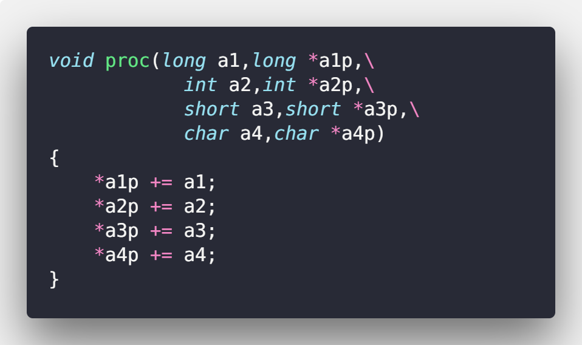|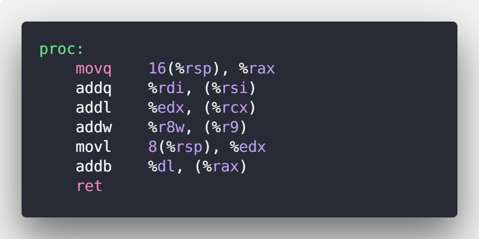|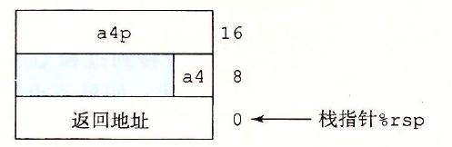|

第六行 `movl` 指令从内存读入 `4` 字节，而后面的 `addb` 指令只使用其中的低位 `1` 字节。

---

### 7.4 栈上的局部存储

以下情况，局部数据必须存放在内存中：

1. 寄存器不足够存放所有的本地数据
2. 对一个局部变量使用地址运算符 `'&'` ，因此必须能够为它产生一个地址。
3. 某些局部变量是数组或结构，因此必须能够通过数组或结构引用被访问到。

一般来说，过程 **通过减小栈指针在栈上分配空间** 。分配的结果是栈帧的一部分，标号为 **局部变量**。

---

### 7.5 寄存器中的局部存储空间

寄存器组是唯一被所有的过程共享的资源。虽然在给定时刻只有一个过程是活动的，我们必须确保一个过程调用另一个过程时，被调用者不会覆盖调用者稍后会使用的寄存器值。为此 x86-64 采用了一组统一的 **寄存器使用惯例** 。

根据惯例，寄存器 `%rbx`、`%rbp`和 `%r12～%r15` 被划分为 **callee-saved** 寄存器。当过程 `P` 调用过程 `Q` 时，`Q` 必须保存这些寄存器的值，保证它们的值在 `Q` 返回到 `P` 时与 `Q` 被 调用时时一样的。过程 `Q` 保存一个寄存器的值不变，要么是不去改变它，要么就是把原始值压入栈中，改变寄存器的值，然后在返回前从栈中弹出旧值。

所有的其他寄存器，除了栈指针 `%rsp` ，都分类为 **caller-saved** 寄存器。这就意味着任何函数都能修改它们。可以这样理解 **caller-saved** 这个名字：过程 `P` 在某个此类寄存器中有局部数据，然后调用过程 `Q` 。因为 `Q` 可以随意修改这个寄存器，所以在调用之前首先保存好这个数据是 `P`( **caller** ) 的责任。

---

### 7.6 递归过程

递归调用一个函数本身与调用其他函数时一样的。栈规则提供了一种机制，每次函数调用都有它自己私有的状态信息(保存的返回位置和被调用者保存寄存器的值)存储空间。如果需要，它还可以提供局部变量的存储。栈分配和释放的规则与函数调用-返回的顺序匹配，当过程被调用时分配局部存储，当返回时释放存储。

---

## 8 数组分配和访问

C 语言中的数组是一种将标量数据聚合成更大数据类型的方式。 C 语言实现数组的方式非常简单，因此很容易翻译成机器代码。C 语言可以产生指向数组中元素的指针，并对这些指针进行运算。在机器代码中，这些指针会被翻译成地址计算。

---

### 8.1 基本原则

`T A[N]` 在内存中分配 `L*N` 字节的联系区域， `L` 为数据类型 `T` 的大小(单位为字节)。可用 `A` 来表示作为数组开头的指针。可以用 `0~N-1` 的整数索引来访问该数组元素。数组元素 `i` 保存在地址为 `A+L*i` 。

`x86-64` 的内存引用指令可以用来简化数组访问。例如，假设 `E` (存放于 `%rax` ) 是一个 `int` 型的数组，而我们想计算 `E[i]` ( `i` 存放于 `%rcx` )，我们可以用 `movl (%rdx,%rcx,4),%eax` 来进行地址计算，读取这个内存位置的值，并将结果存放到 `%eax` 中。允许的伸缩因子 `1` 、`2` 、`4` 和 `8` 覆盖了所有基本简单数据类型的大小。

---

### 8.2 指针运算

C 语言允许对指针进行运算，而计算出来的值会根据该指针引用的数据类型的大小进行伸缩。

单操作数操作符 `'&'` 和 `'*'` 可以产生指针和间接引用指针。

---

### 8.3 嵌套的数组

当创建数组的数组时，数组分配和引用的一般原则也是成立的。eg： 

```c
int A[5][3] 
//等价于 
typedef int row3_t[3]; 
row3_t A[5];
//将A看做是一个有5个元素的数组
//每个元素都是3个int的数组
```

对于 `T D[R][C]` ，数组元素 `D[i][j]` 的内存地址为 `&D[i][j]=D+L*(C*i+j)` 。对于上面 `5x3` 的整型数组 `A` 。假设 `A` 、 `i` 、`j` 分别在寄存器 `%rdi` 、`%rsi` 和 `%rdx` 中，可以用下面代码将数组元素 `A[i][j]` 复制到寄存器 `%eax` 中：

```asm
leaq (%rsi,%rsi,2),%rax ;compute 3i
leaq (%rdi,%rax,4),%rax ;compute A+12*i
movl (%rax,%rdx,4),%eax ;read from M[A+12*i+4*j]
```

---

### 8.4 定长数组

`C` 语言编译器能够优化定长多维数组上的操作代码。下面展示优化等级设置为 `-O1` 时 `GCC` 采用的一些优化。

计算矩阵 `A` 和 `B` 乘积的元素 `i` , `k` ，即 `A` 的行 `i` 和 `B` 的 列 `k` 的内积：

|原始 `C` 代码|优化等级 `-O1` 的汇编代码|反汇编的 `C` 代码|
|:---:|:---:|:---:|
|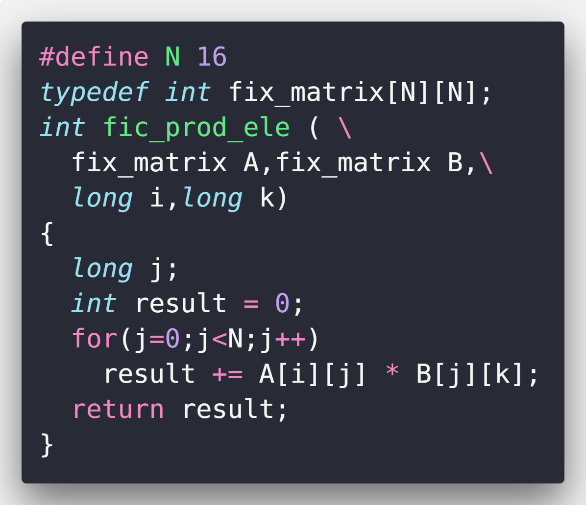|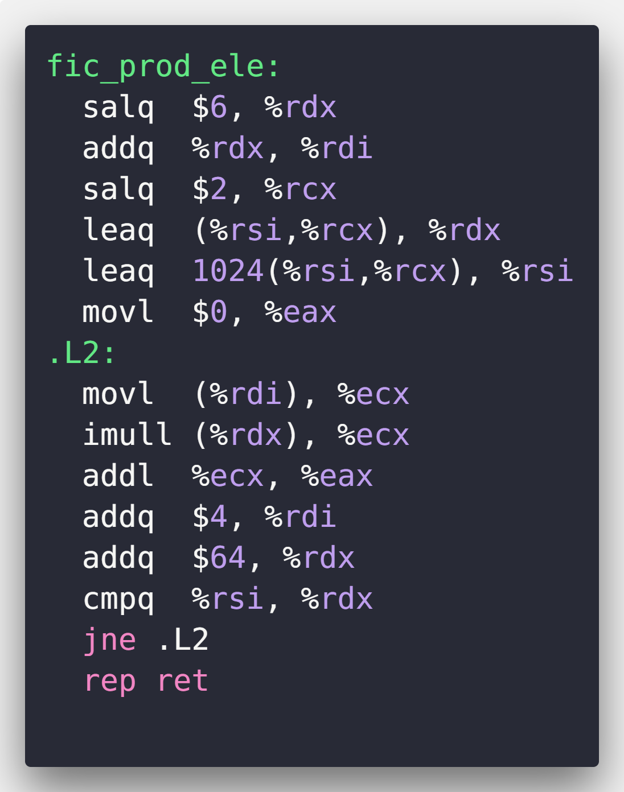|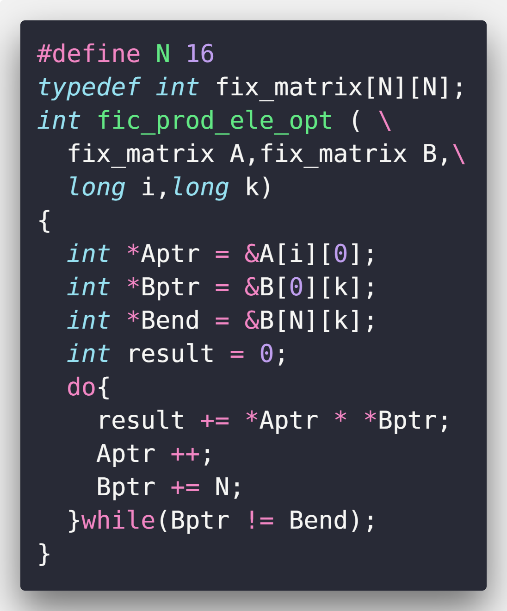|

优化代码取代了整数索引j，并把所有的数组引用都转换成了指针间接引用。如果对比优化前后的汇编代码会发现，汇编代码长度大幅减少。

---

### 8.5 变长数组

以前，`C` 语言只支持大小在编译时就确定的多维数组（第一维可能例外）。程序员需要变长数组时智能 `malloc` 或`calloc` 为数组分配存储空间，而且需要显示编码，用行优先索引将多维数组映射到一维数组。`ISO C99` 允许数组的维度时表达式，在数组分配时才配计算出来。

```c
int A[expr1][expr2]

//参数n必须在参数A[n][n]之前
//这样函数就可以在遇到这个数组的时候计算出数组的维度
int var_ele(long n,int A[n][n],long i,long j){
    return A[i][j];
}
```

```asm
;n in %rdi,A in %rsi,i in %rdx,j in %rcx
var_ele:
    imulq %rdx,%rdi ;compute n*i
    leaq (%rsi,%rdi,4),%rax ;compute A+4*(n*i)
    movl (%rax,%rcx,4),%rax read from M[A+4*(n*i)+4j]
```

这段代码计算元素 `i` 、 `j` 的地址为 `A+4*(n*i+j)` 。 不同点：1. 使用了 `n` ；2. 用了乘法指令计算 `n*i` (会招致性能处罚)。如果允许优化， `GCC` 能够识别出程序访问多维数组的步长，生成的代码避免应用惩罚。不论生成基于指针的代码还是基于数组的代码，都能显著提高程序的性能。

---

## 9 异质的数据结构

C 语言提供了两种将不同类型的对象组合到一起创建数据类型的机制：**结构(structure)**，用关键字 `struct` 来声明，将多个对象集合到一个单位中；**联合** ,用关键字 `union` 来声明，允许用几种不同的类型来引用一个对象。

---

### 9.1 结构

`C` 语言的 `struct` 声明创建一个数据类型，将可能不同类型的对象聚合到一个对象中。用名字来引用结构的各个部分。类似于数组的实现，结构的所有组成部分都存放在一段连续的区域中，而指向结构的指针就是结构第一个字节的地址。编译器维护关于每个结构类型的信息，指示每个 **字段(field)** 的字节偏移。它以这些偏移作为内存引用指令中的位移，从而产生对结构元素的引用。

---

#### 将一个对象表示成 struct

```c
//长方形
struct rect{
    long llx;
    long lly;
    unsigned long width;
    unsigned long height;
    unsigned color;
}

struct rect r;
r.llx = r.lly = 0;
r.color = 0xFF00FF;
r.width = 10;
r.height = 20;

struct rect r = {0,0,10,20,0xFF00FF};

long area (struct rect *rp){
    return (*rp).width * (*rp).height;
    //the same as
    return rp->width * rp-> height;
}
```

结构的各个字段的选取完全是在编译时处理的。机器代码不包含关于字段声明或字段名字的信息。

---

### 9.2 联合

**联合** 提供了一种方式，能够规避 `C` 语言的类型系统，**允许以多种类型来引用一个对象**。

```c
struct S3{
    char c;
    int i[2];
    double v;
}

union U3{
    char c;
    int i[2];
    double v;
}
```

在 `x86-64 Linux` 的机器上编译时，字段的偏移量、数据类型 `S3` 和 `U3` 的完整大小如下：

|类型|`c`|`i`|`v`|大小|
|:---:|:---:|:---:|:---:|:---:|
|`S3`|`0`|`4`|`16`|`24`|
|`U3`|`0`|`0`|`0`|`0`|

对于类型 `union U3 *` 的指针 `p`，`p->c` 、 `p->i[0]` 、 `p->y` 引用的都是数据结构的起始位置。**一个联合的总的大小等于它最大字段的大小**。

如果事先知道一个数据结构中的两个不同字段的使用是互斥的，那么将这两个字段声明为联合的一部分，而不是结构的一部分，会减少分配空间的总量。

---

### 9.3 数据对齐

计算机系统系统对基本数据类型的合法地址做成了一些限制，要求某种类型对象的地址必须是某个值 `K` （通常是 `2` 、 `4` 或 `8` ）的倍数。这种 **对齐限制** 简化了形成处理器和内存系统之间接口的硬件设置。

**对齐原则：** 任何 `K` 字节的基本对象的地址必须是 `K` 的倍数。

编译器在汇编代码中放入命令，指明全局数据所需的对齐。eg： `.align 8` 保证了他后面的数据的起始地址是8的倍数。

对于一个 **结构体** 来说，所占据的内存空间必须是最大的类型所需字节的倍数。

根据这种特点，在设计结构体的时候可以采用一些技巧。例如，要把大的数据类型放到前面。

---

#### 强制对齐

大多数 `x86-64` 指令，保持对齐能够提高效率，但不会影响程序的行为。但有些型号的 `Intel` 和 `AMD` 处理器对于有些实现多媒体操作的 `SSE` 指令，就无法正确执行。这些指令对 `16` 字节数据块进行操作，在 `SSE` 单元和内存之间传送数据的指令要求内存地址必须是 `16` 的倍数。任何试图以不满对齐要求的地址来访问内存都会导致异常，默认的行为是程序终止。

因此，任何针对 `x86-64` 处理器的编译器和运行时系统都必须保证分配用来保存可能会被 `SSE` 寄存器读或写的数据结构的内存，都必须满足 `16` 字节对齐。这导致：

* 任何内存分配函数( `alloca` 、 `malloc` 、 `calloc` 或 `realloc` )生成的块的起始地址都必须是 `16` 的倍数
* 大多数函数的栈帧的边界都必须是 `16` 字节的倍数（有一些例外）

较劲版本的 x86-64 处理器实现了 `AVX` 多媒体指令。除了提供 `SSE` 指令的超级，支持 `AVX` 的指令并没有强制性的对齐要求。


---

## 10 在机器级程序中将控制与数据结合起来

We review the use of the symbolic debugger GDB for examining the detailed operation of machine-level programs. Next, we see how understanding machine-level programs enables us to study buffer overflow, an important security vulnerability in many real-world systems. Finally, we examine how machine-level programs implement cases where the amount of stack storage required by a function can vary from one execution to another.

---

### 10.1 理解指针

**指针** 以一种统一的方式，对不同的数据结构中的元素产生引用。

* 每个指针都对应一个类型，这个类型表明该指针指向的是哪一类对象。`void *` 代表通用指针。
* 每个指针都有一个值，这个值代表某个指定类型的对象的地址。特殊的 `NULL(0)` 值表示该指针没有指向任何地方。
* 指针用 <kbd>&</kbd> 运算符创建。`&` 的机器代码常用 `leaq` 指令来实现。
* <kbd>*</kbd> 操作符用于间接引用指针。
* 数组与指针紧密联系。一个数组的名字可以像一个指针变量一样引用(但不能修改)。数组引用于指针运算和间接引用有一样的效果。
* 将指针从一种类型强制转换成另一种类型，只改变它的类型，不改变它的值
* 指针也可以指向函数。函数指针的值是该函数机器代码表示中第一条指令的地址。

```c
int fun(int x,int *p);
int (*fp) (int,int *);
fp = fun;
int y = 1;
int result = fp(3,&y);
```

---

### 10.2 应用：使用GDB调试器

```bash
linux> gdb prog
```

相对于命令行借口来访问 `GDB` ，更多程序员更愿意使用 `DDD` ，它是 `GDB` 的一个拓展，提供了图形用户界面。

---

### 10.3 内存越界引用和缓冲区溢出

`C` 对于数组引用不进行任何便捷检查，而且局部变量和状态信息（保存的寄存器和返回地址）都存放在栈中。这两种情况结合到一起就能导致很严重的程序错误。当程序使用这个被破坏的状态，试图重新加载寄存器或执行 `ret` 指令时，就会出现很严重的错误。


一种常见的状态破坏称为 **缓冲区溢出(buffer-overflow)** 。通常，在栈中分配某个字符数组来保存一个字符串，但是字符串的长度超出了为数组分配的空间。

```c
char *gets(char *s)
{
    int c;
    char *dest = s;
    while( (c=getchar())!='\n' && c != EOF)
        *dest++ = c;
    if(c == EOF && dest == s)
        return NULL;
    *dest++ = '\0';
    return s;
}

void echo()
{
    char buf[8];
    gets(buf);
    puts(buf);
}
```

`gets` 的问题是它没法确定是否为保存整个字符串分配了足够的空间。在 `echo` 示例中，缓冲区只有 `8` 个字节。任何长度超出 `7` 个字符的字符串都会导致越界。

缓冲区溢出后，返回指针的值以及更多可能的保存状态被破坏。返回地址的值被破坏会导致程序跳转到一个完全意想不到的位置。

缓冲区溢出的一个更加致命的使用就是让程序执行它本来不愿意执行的函数。这是一种最常见的通过计算机网络攻击系统安全的方法。通常，输入给程序一个字符串，这个字符串包含一些可执行代码的字节编码，称为 **攻击代码** ，另外还有一些字节会用一个指向攻击代码的指针覆盖返回地址。那么，执行 `ret` 指令的效果就是跳转到攻击代码。

攻击形式：

* 攻击代码使系统调用一个 `shell` 程序，给攻击者提供一组操作系统函数。
* 攻击代码会执行一些未授权的任务，修复对栈的破坏，然后二次执行 `ret` 指令，（表面上）正常返回到调用者。

---

### 10.4 对抗缓冲区溢出攻击

`Linux` 上最新 `GCC` 版本所提供的机制：

#### 栈随机化

为了在系统中插入攻击代码，攻击者既要插入代码，也要插入指向这段代码的指针，这个指针也是攻击字符串的一部分。产生这个指针需要知道这个字符串放置的栈地址。在过去，栈的地址非常容易预测。对于所有运行同样程序和操作系统版本的系统来说，不同机器之间，栈的位置很固定。如果攻击者可以确定一个常见的web服务器所使用的占空间，就可以设计一个在许多机器上都能实施的攻击。许多系统都容易收到同一种病毒的攻击，这被称作 **安全单一化** 。

**栈随机化** 使栈的位置在程序每次运行时都有变化。因此，即使许多机器都运行同样的代码，他们的栈地址都是不同的。实现的方式是：程序开始时，在栈上分配一段 0~u 字节之间的随机大小的空间。

栈随机化在 `Linux` 系统中已经变成了标准行为。它属于 **地址空间布局随机化(Address-Space Layout Randomization)** 。采用 `ASLR` 每次运行时程序的不同部分，包括程序代码、库代码、栈、全局变量和堆数据，都会被加载到内存的不同区域。

然而，攻击者总是能用蛮力克服随机化，攻击者可以反复地用不同的地址进行攻击。一个常见的巴西就是在实际的攻击代码前插入很长的一段 nop(no operation) 指令。只要攻击者能够猜中这段序列中的某个地址，程序就会经过这个序列到达攻击代码。

---

#### 栈破坏测试

破坏通常发生在超越局部缓冲区的边界。最近的 GCC 在产生的代码中加入了 栈保护者(stack protector) 机制来检测缓冲区越界。其思想是在栈帧中任何局部缓冲区与栈状态之间存储一个特殊的 金丝雀(canary)[也称 哨兵值(guard value) ] 值，实在程序每次运行时随机产生的(攻击者无法简单地知道它是什么)。 在恢复寄存器状态和从函数返回之前，程序检查这个金丝雀值是否被该函数的某个操作或者该函数调用的某个函数的操作改变了。如果是，程序异常终止。

GCC 会试着确定一个函数是否容易遭受栈溢出攻击，并且自动插入这种溢出检测。可以用命令行 `-fno-stack-protector` 来阻止 GCC 产生这种代码。

---

#### 限制可执行代码区域

消除攻击者向系统中插入可执行代码的能力。限制哪些内存区域能存放可执行代码，在典型的程序中，只有保存编译器产生的代码的那部分内存才需要可执行。其他部分限制为只允许读和写。

---

### 10.5 支持变长栈帧

有些函数需要的局部存储是变长的。alloca 是一个标准库函数，可以在栈上分配任意数量的存储。

为了管理变长栈帧， x86-64 代码使用寄存器 %rbp 作为 帧指针(frame pointer ) 或 基指针 ( base pointer ) 。

---

## 11 浮点代码


---

### 11.1 浮点传送和转换操作

### 11.2 过程中的浮点代码

### 11.3 浮点运算和操作

### 11.4 定义和使用浮点常数

### 11.5 在浮点代码中使用位级操作

### 11.6 浮点比较操作

### 11.7 对浮点代码的观察结论
